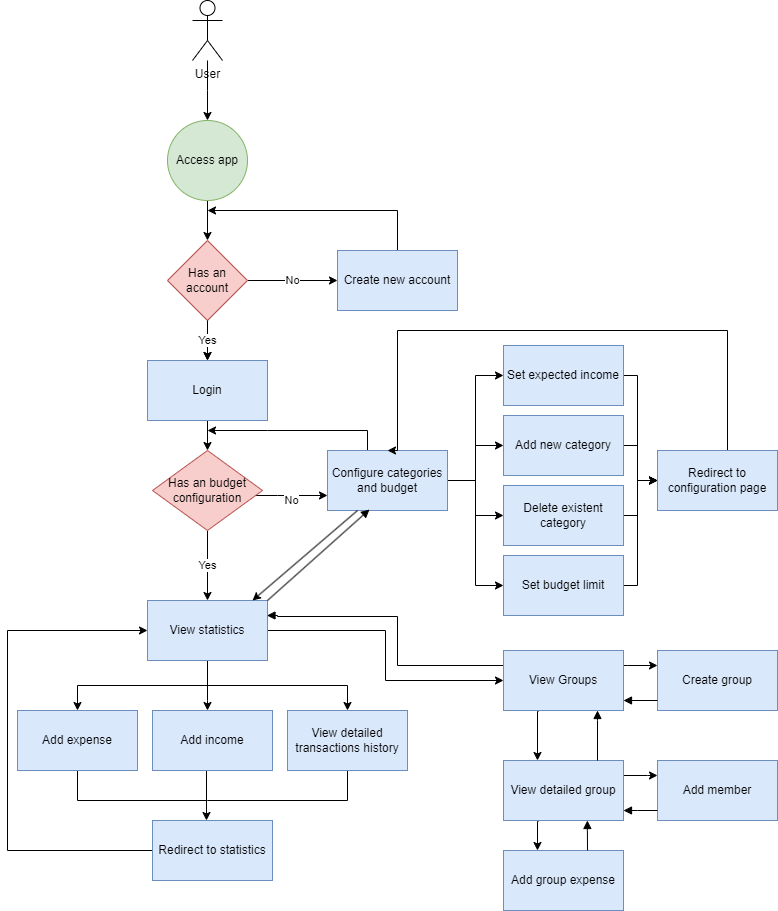

# Description
The budgeting aspect of finances is oftentimes overlooked by many people because they find it tedious. Seeing how important it is to have discipline when spending, to prioritize categories and to get an outlook on your habits in order to correct them, we have developed this app, that will be available on the Web, IOS and Android in order to help more people get into budgeting by providing a sleek and intuitive user interface that makes budget tracking a breeze. It ensures a seamless experience for both people that are new to budgeting and more experienced users that were not happy with the current options on the market.

Our Budget Tracker App enables users to manage their incomes, expenses and debts to other users. They can add categories of incomes, expenses and expected income, spending limits for these categories. After a unit of time (month or year), a user can visualize a graphical and detailed review in order to get a better overview of their spending habits. Moreover, users have the option to associate in a group to track their expenses together and use our algorithm to help them make the minimum number of transactions when splitting the bills within the group members.

The app has been developed with the Flutter framework (Dart) for frontend and the SpringBoot framework (Java) for backend.

### Team members:
- [Talpalariu Iulia Georgiana](https://github.com/iuliali)
- [Mura Victor](https://github.com/victormura)
- [Sabau Eduard](https://github.com/SabauEduard)
- [Rogoza Raluca](https://github.com/ralucarogoza)

## 1. User stories and backlog
We have used Jira to monitor the progress of the project and to keep track of the user stories and backlog. The issues are marked as in progress because Jira archives them if we mark them as completed.

## 2. Diagrams
### WORKFLOW DIAGRAM

### UML DIAGRAM

## 3. Source control
The project has been developed with the help of GitHub so all the commits, branches and pull requests can be accessed from here. We have used the Feature Branch Workflow paradigm as in each new feature is developed on a separate branch and then merged into main with a pull request.
## 4. Testing
The automated tests for backend are in the package defined by SpringBoot and can be found at [this link.](https://github.com/iuliali/budget-tracker/tree/main/api/src/test/java/com/budgettracker/api/budgeting/unit)
## 5. Refactoring and code standards
There is a branch named refactor in which we modified the structure of the packages for the backend and bit of the code structure to provide a seamless transition to microservices from monolith in case we will decide so. [This is the link to the refactor branch.](https://github.com/iuliali/budget-tracker/tree/refactor/api/src/main/java/com/budgettracker/api)
## 6. Design Patterns
- Model: The classes that represent the entities in the UML diagram (e.g. User, Category, Expense, Income, etc.)
- Facade: AuthenticationFacade class that provides a way to get the logged-in user.
- Control: The controllers that represent the way you can interact with the API
- Singleton: Indirectly by using the SpringBoot service and repository annotations which make the classes singletons.
## 7. Use of AI tool
All the unit tests for backend were generated using ChatGpt. Most of them were working as intended, but some were wrong as in the test not passing because it wouldn't mock the correct entities, or it wouldn't expect the correct values. So, after generating them, we had to review the code and fix the issues.

Some team members used GithubCopilot when developing the app. It would generate code by processing the rest of the code you have written and "guessing" what you are trying to do. All the code generated had to be reviewed because it would sometimes generate broken code.