# Budget Tracket App *[livrabil 1]*

#### Rules for adding your work:
- create a new branch named `your-name/your-work`
- add changes requested in next steps
- identify the section you worked on down below
- add text in section you worked on
- add needed diagrams/ screenshots in dedicated folder `./diagrams-screenshots/`
- add link to diagrams/ screenshots added with markdown code: ``
- push your new branch and create a pull request
- ping a team member to review and approve your request
___
#### Team
- Daria Clem
- Valentin Maftei 
- Victor Mura
- Raluca Rogoza
- Eduard Sabău
- Iulia-Georgiana Talpalariu

___
### Documenting existing MDS application
[Link to the documentation pdf](./mds_existing_app.pdf)

___
### Product Vision

___
### Product features and functionalities
For a better quality of the items check the [Figma link.](https://www.figma.com/file/t1Nv4sIAPO4dklhro59N56/Budget-Tracker?type=whiteboard&node-id=0%3A1&t=k0Irlfbz6AjT8F5K-1)
#### Feature Mindmap
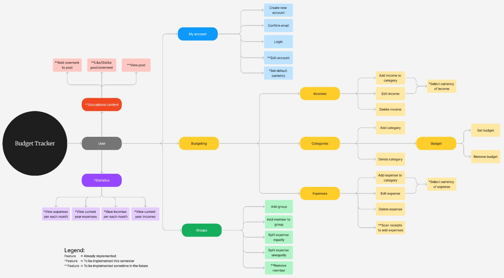

#### Product Roadmap
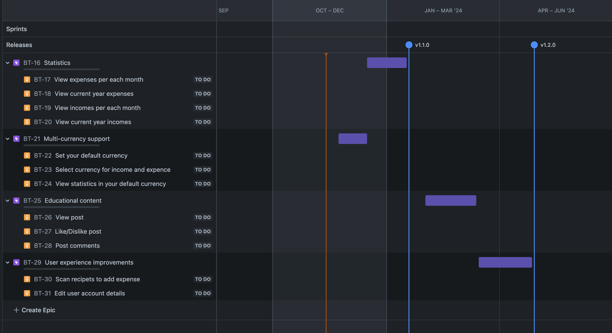

#### Integration Points
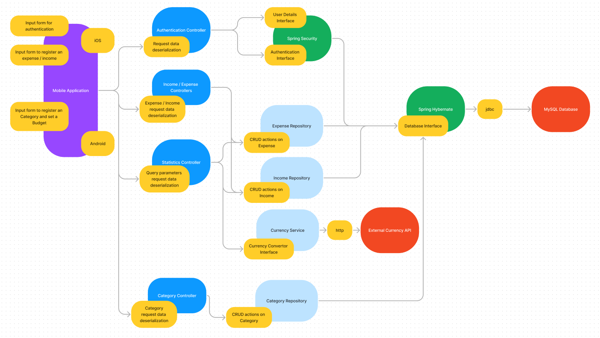

___
### Customer Journey
#### User personas
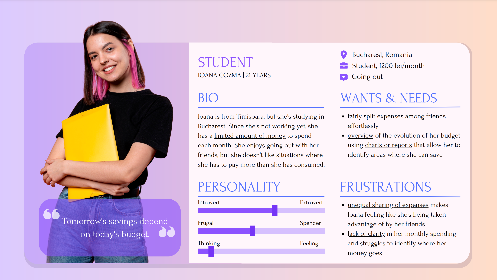
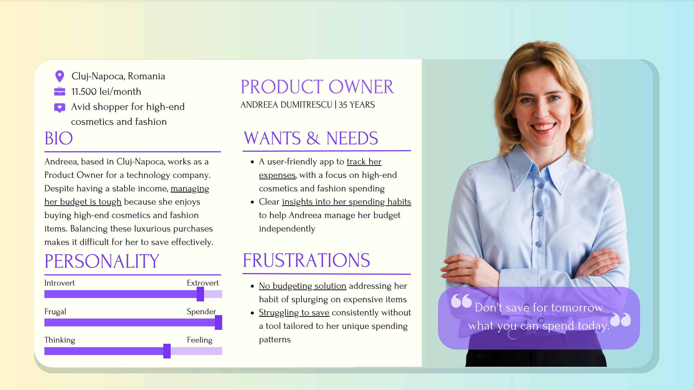

#### User journey map
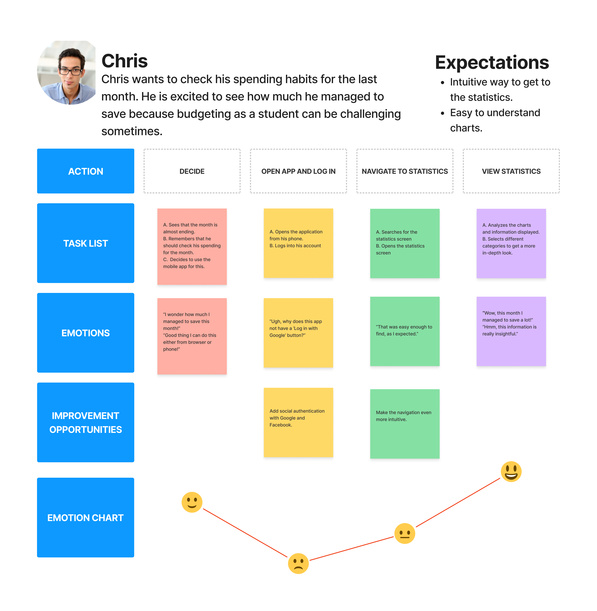

___
### Activity Diagram
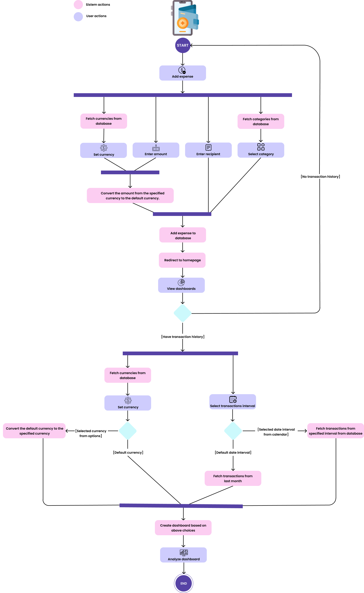

---
### Non-functional requirements
- **Performance**\
Achieve a response time of 1 second or less for user interactions, such as adding an expense or viewing a budget report for at least 100 simultaneous requests.
- **Reliability**\
Maintain an availability rate of 99.5% yearly, allowing for scheduled maintenance windows.
- **Security**\
Implement secure user authentication with strong password policies at least 8 characters upper and lower case characters and at least a symbol and password hashing with bcrypt algorithm.
- **Usability**\
Maintain an intuitive and user-friendly interface for managing budgets without extensive training, with a maximum 4 actions/user interactions to achieve any functionality.
- **Compatibility**\
Ensure smooth operation on phone devices with iOS 8 and higher and Android 10 and higher operation systems.

___
### User Stories
#### + Acceptance Criteria

1. As a student, I want to see an overview of my recent spending habits, in order to set bugets for categories of expenses I spend the most. *[3 story points]*

- GIVEN I OPEN THE APP BEING LOGGED IN INTO MY ACCOUNT,\
WHEN I GO TO STATISTICS PAGE,\
THEN I SEE MY TOTAL OF EXPENSE AND CATEGORY WHICH I SPENT THE MOST.

- GIVEN I OPEN THE APP BEING LOGGED IN INTO MY ACCOUNT AND HAVE NEVER REGISTERED AN EXPENSE OR INCOME,\
WHEN I GO TO STATISTICS PAGE,\
THEN I SEE AN ERROR MESSAGE.

2. As a young person, I want to see a screen with concise summary of last month expenses/incomes in order to see which bugets should I limit in the next period of time. *[3 story points]*

- GIVEN I AM LOGGED IN MY ACCOUNT AND ON THE STATISTICS PAGE,\
WHEN I GO TO EXPENSES SECTION,\
THEN I PERCIEVE IN A GRAPHICAL FORM MY TOTAL OF LAST MONTH REGISTERED EXPENSES BY CATEGORIES.

- GIVEN I AM LOGGED IN MY ACCOUNT AND ON THE STATISTICS PAGE,\
WHEN I GO TO EXPENSES SECTION,\
THEN I PERCIEVE IN A GRAPHICAL FORM MY TOTAL OF LAST MONTH-REGISTERED EXPENSES WITH CATEGORIES I EXCEEDED MY BUDGETS HIGHLIGHTED.

- GIVEN I AM LOGGED IN MY ACCOUNT AND ON THE STATISTICS PAGE,\
WHEN I GO TO INCOMES SECTION,\
THEN I PERCIEVE IN A GRAPHICAL FORM MY TOTAL OF LAST MONTH REGISTERED INCOMES BY CATEGORIES.

3. As a mom, I want to have a page from where to quickly access last year expenses/incomes so that I can realize where I am related to my financial goals and buget limits.*[5 story points]*

- GIVEN I AM LOGGED IN MY ACCOUNT AND ON THE STATISTICS PAGE,\
WHEN I GO TO EXPENSES SECTION, \
THEN I PERCIEVE IN A GRAPHICAL FORM MY TOTAL OF LAST YEAR-REGISTERED EXPENSES BY MONTHS.

- GIVEN I AM LOGGED IN MY ACCOUNT AND ON THE STATISTICS PAGE,\
WHEN I GO TO EXPENSES SECTION, \
THEN I PERCIEVE IN A GRAPHICAL FORM MY TOTAL OF LAST YEAR-REGISTERED EXPENSES BY CATEGORIES.

- GIVEN I AM LOGGED IN MY ACCOUNT AND ON THE STATISTICS PAGE,\
WHEN I GO TO EXPENSES SECTION,\
THEN I PERCIEVE IN A GRAPHICAL FORM MY TOTAL OF LAST YEAR-REGISTERED EXPENSES WITH MONTHS I EXCEEDED MY BUDGETS HIGHLIGHTED.

- GIVEN I AM LOGGED IN MY ACCOUNT AND ON THE STATISTICS PAGE,\
WHEN I GO TO INCOMES SECTION, \
THEN I PERCIEVE IN A GRAPHICAL FORM MY TOTAL OF LAST YEAR-REGISTERED INCOMES BY MONTHS.

- GIVEN I AM LOGGED IN MY ACCOUNT AND ON THE STATISTICS PAGE,\
WHEN I GO TO INCOMES SECTION, \
THEN I PERCIEVE IN A GRAPHICAL FORM MY TOTAL OF LAST YEAR-REGISTERED INCOMES BY CATEGORIES.

4. As a traveler, I want to register my expenses and incomes in various currencies in order to keep track of them.  *[3 story points]*

- GIVEN  I AM LOGGED IN MY ACCOUNT,\
WHEN I OPEN ADD AN EXPENSE OPTION,\
THEN I CAN CHOOSE THE CURRENCY IN WHICH TO REGISTER IT.

- GIVEN  I AM LOGGED IN MY ACCOUNT,\
WHEN I OPEN ADD AN INCOME OPTION,\
THEN I CAN CHOOSE THE CURRENCY IN WHICH TO REGISTER IT.

5. As a traveller, I want to set my default currency in order to have it already selected for adding expenses. *[2 story points]*

- GIVEN  I AM LOGGED IN MY ACCOUNT,\
WHEN I ACCESS PAGE FOR BUDGET ACCOUNT SETTINGS,\
THEN I CAN SET THE DEFAULT CURRENCY.

6. As a trip lover, I want to see my statistics in my default currency and change it while looking at them in order to have a better view of my spending habits. *[3 story points]*

- GIVEN  I AM LOGGED IN MY ACCOUNT,\
WHEN I ACCESS STATISTICS PAGE,\
THEN I CAN SEE MY STATISTICS IN MY DEFAULT CURRENCY\
AND ALSO CHANGE STATISTICS CURRENCY IN CURRENT VIEW.

___
### Prioritized Product Backlog
#### Selected User Stories for first sprint (+ estimated)
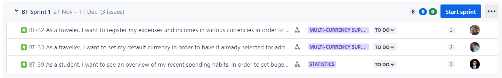
#### User Story 1
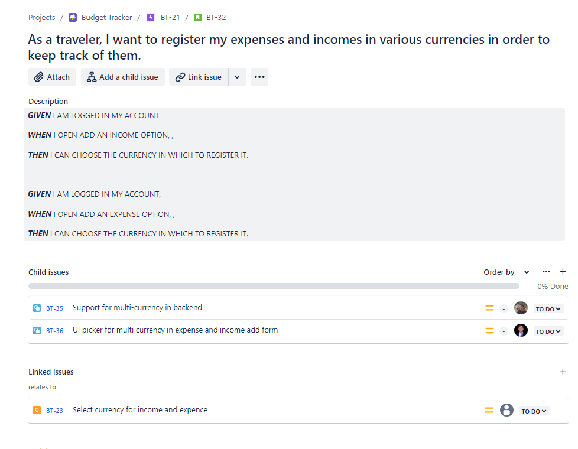
#### User Story 2
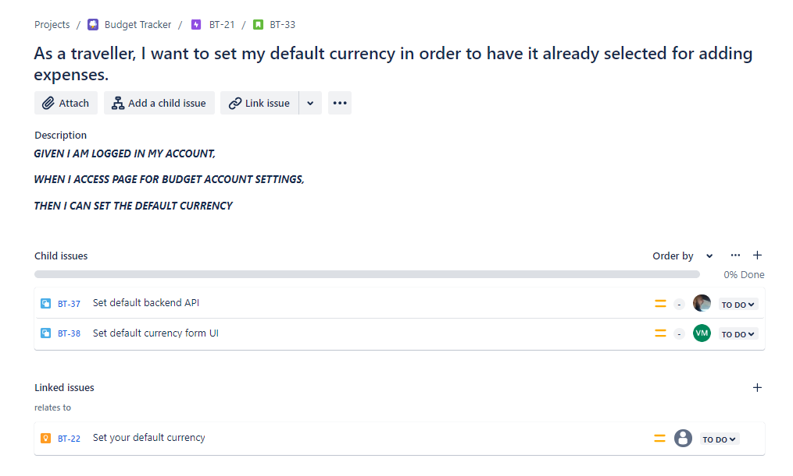
#### User Story 3
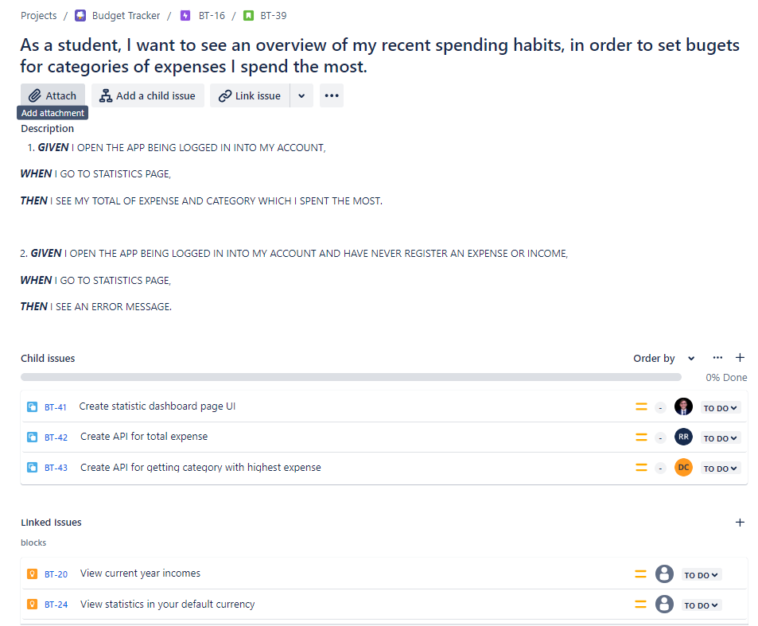
___
#### Rest of Backlog
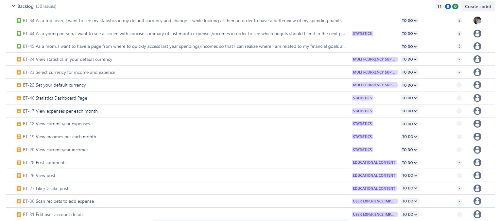
